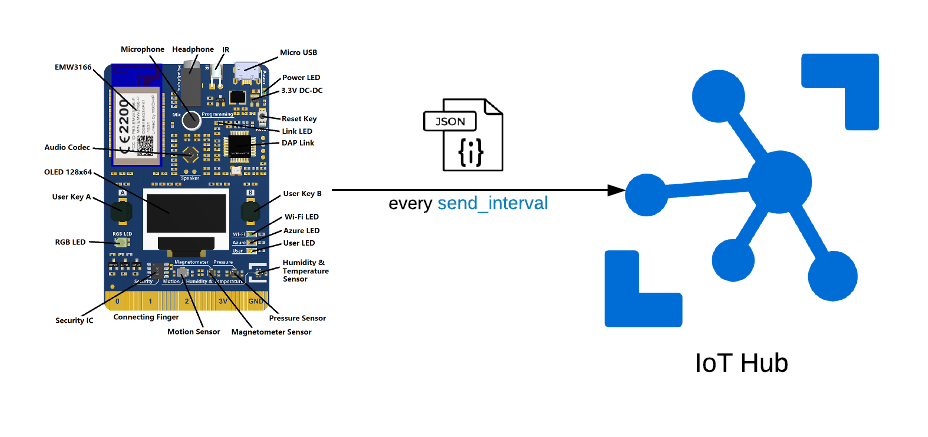

# RoomTempDevice-IoT
Sends sensor data to Azure IoT Hub at a defined interval



## Getting Started
* Run through [Get started - IoT DevKit guide](https://microsoft.github.io/azure-iot-developer-kit/docs/get-started/)
    * Prepare your development environment
    * Provision your device using the Azure DPS
    * Load your IoT Hub Device Connection String
    * Git clone && Upload Device Code

## Configuration

|| Description|
|---|---|
|`send_interval`|The interval at which the device will send the payload to [IoT Hub](https://azure.microsoft.com/en-au/services/iot-hub/).|
|`setup_delay` | The delay the setup messages will be displayed on the screen.|


## Payload <a name="payload"></a>

An example of the payload that will be sent to [IoT Hub](https://azure.microsoft.com/en-au/services/iot-hub/)

```JSON
{
	"topic": "iot",
	"Temperature": 31.2999990000000,
	"Humidity": 47.0000000000000
}
```

## Realtime Dashboard

See [RoomTempDashboard] for a realtime data dashboard